#CONSULTAS SQL

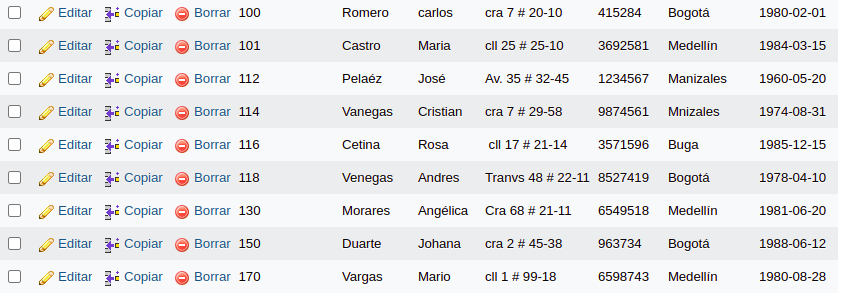

1. Para visualizar toda la informacion que contiene la tabla `usuario` se puede incluir con la inclusion SELCET el caracter "*" o cada uno de los campos de la tabla
`select * from usuario`

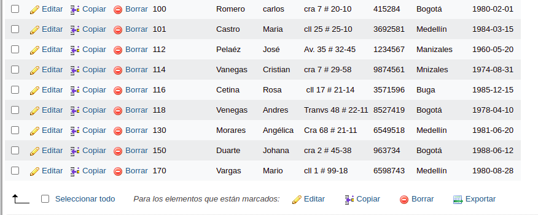

2. Visualizar solamente la identificacion del usuario.

`select Identification from usuario`

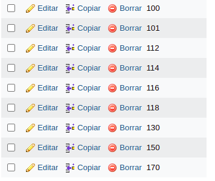

3. Se desea obtener los registros cuya identidad sea mayores o iguales a 150, se utiliza la clausula where que especifica los condiciones que deben reunir los registros que se vam a seleccionar.

`SELECT * FROM usuario WHERE identification>='150'`

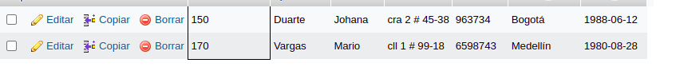

4. Si se desea obtener los registros cuyos sus apellido sean Vanegas o Cetina, se debe utilizar el operador IN que especifica los registros que se quieren visualizar de una tabla.

`SELECT apellidos FROM usuario WHERE apellidos IN ('Vanegas', 'Cetina')`

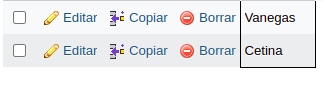

O se puede utilizar el operador OR

`SELECT apellidos FROM usuario WHERE apellidos ='Vanegas' OR apellidos ='Cetina'`

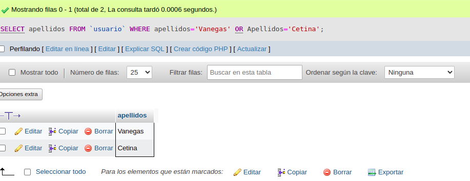

5. Si se desea obtener los registros cuya identificacion sea menor de '150'  y la ciudad sea 'Cali', se debe utilizar el opredaor AND.

`SELECT * FROM usuario WHERE Identificación<'150' AND ciudad_nac='Cali'`

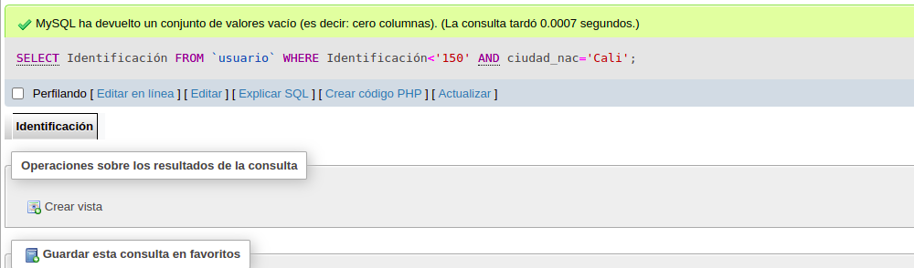

6. Si se desea obtener los regitros cuyos nombres empiecen por la letra 'A', se debe utilizar el operador LIKE que utiliza los patrones '%' (Todos) y '_' (caracter)

`SELECT * FROM usuario WHERE nombre LIKE 'A%'`

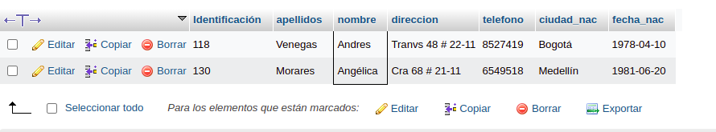

7. Si se desea obtener los registros cuyo nombre contenga la letra 'a'.

`SELECT * FROM usuario WHERE nombre LIKE 'a%'`

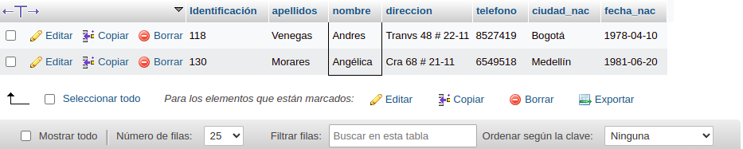

8. Si se desea obtener los registros donde la cuarta letra del nombre sea una 'a'

`SELECT * FROM usuario WHERE 

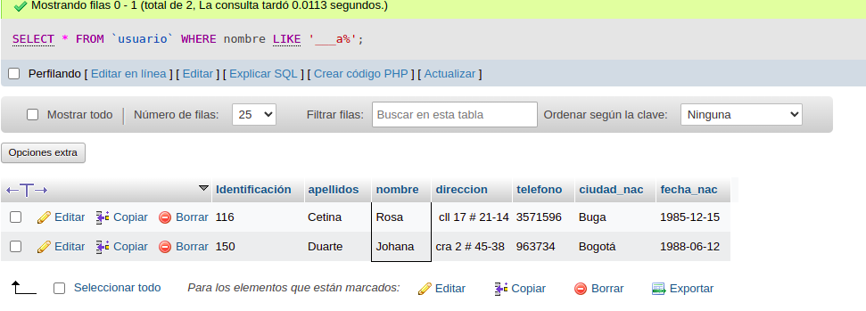

nombre LIKE '___a%`

9. Si se desea obtener los registros cuya identificacion este entre el intervalo 110 y15, se debe utilizar la clausula BETWEEN, que sirve para especificar un intervalo de valores.

`SELECT * FROM usuario WHERE Identificación BETWEEN '110' AND '150'`

##COMANDO DELETE

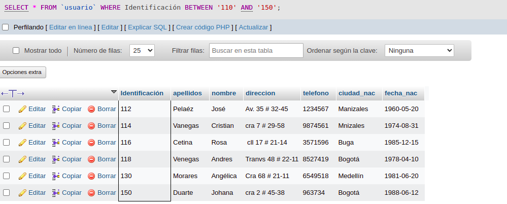

10. Para utilizar solamente los registros cuya identificacion sea mayor de 130

`DELETE * FROM usuario WHERE Identificación>130´`

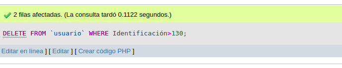

##COMANDO UPDATE

11. Para actualizar la ciudad de nacimiento de Cristian Vanegas, cuya indentificación es 114

`UPDATE usuario SET ciudad nac='Manizales' WHERE Identificación='114'`

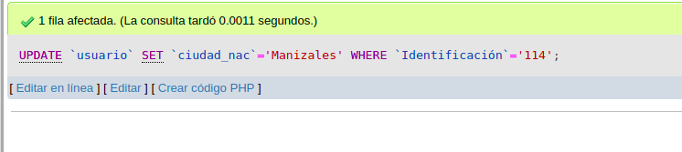

##INNER JOIN 

Permite obtener datos de dos o mas tablas. Cuando se realiza la concatacion de las tablas, no necesariamente se debe mostrar todos los datos de las tablas 

##Tabla pedidos

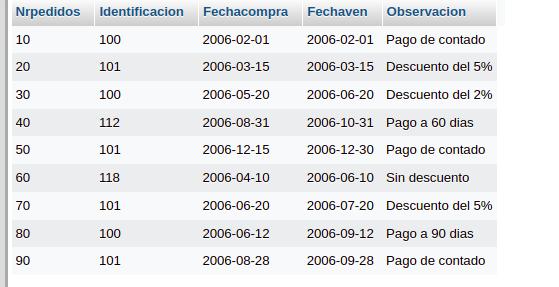

12. Para visualizar los campos identificacion, nombre, apellidos de la tabla usuario y numero pedido, fecha de compra, fecha de vencimiento y observacion de la tabla pedidos. Se debe realizar la siguiente instruccion SQL:

`SELECT usuario.Identificación, usuario.nombre, usuario.apellido, pedido.nropedido, pedido.fechaCompra, pedido.fechaVence, pedidos.observacion FROM usuario INNER JOIN pedidos ON usuario.Identificación = pedidos.Identificación`

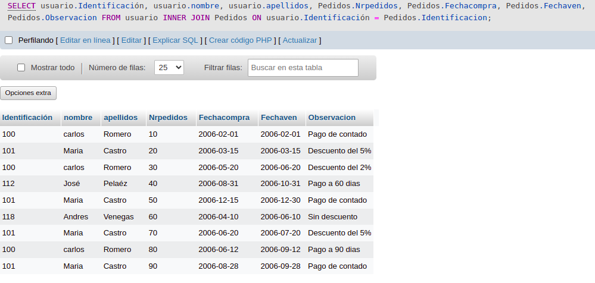

13. Para visualizar todos los campos de las tablas usuarios y pedidos donde identificacion sea mayor que 100, se debe realizar la siguiente instruccion: 

SELECT usuario.* , Pedidos.* FROM usuario INNER JOIN Pedidos ON usuario.Identificación= Pedidos.Identificacion WHERE usuario.Identificación>100;

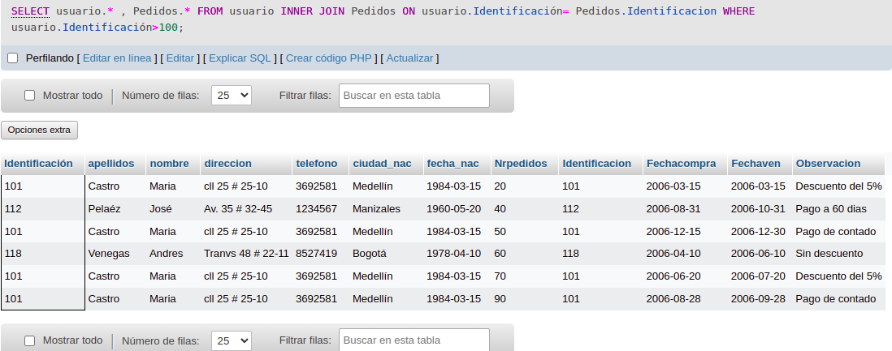

