# CONSULTAS SQL

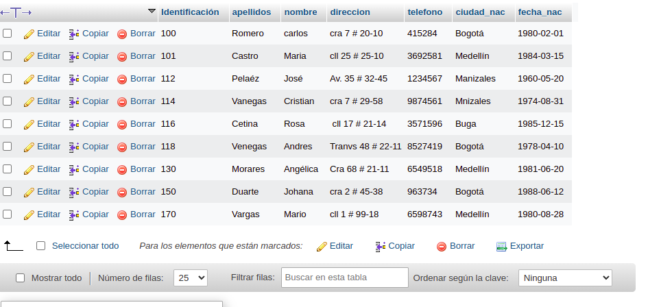

1. Para visualizar toda la informacion que contiene la tabla `usuario` se puede incluir con la inclusion SELCET el caracter "*" o cada uno de los campos de la tabla
`select * from usuario`

2. Visualizar solamente la identificacion del usuario.

`select Identification from usuario`

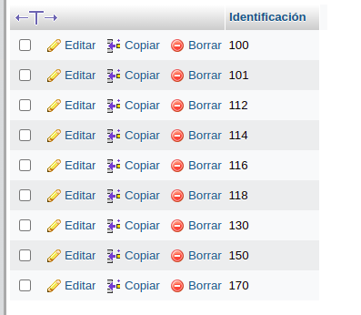

3. Se desea obtener los registros cuya identidad sea mayores o iguales a 150, se utiliza la clausula where que especifica los condiciones que deben reunir los registros que se vam a seleccionar.

`SELECT * FROM usuario WHERE identification>='150'`br

4. Si se desea obtener los registros cuyos sus apellido sean Vanegas o Cetina, se debe utilizar el operador IN que especifica los registros que se quieren visualizar de una tabla.

`SELECT apellidos FROM usuario WHERE apellidos IN ('Vanegas', 'Cetina')`

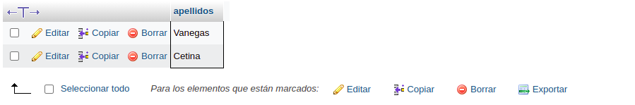

O se puede utilizar el operador OR

`SELECT apellidos FROM usuario WHERE apellidos ='Vanegas' OR apellidos ='Cetina'`

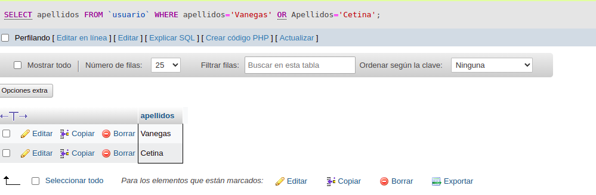

5. Si se desea obtener los registros cuya identificación sea menor de '150' y la ciudad sea 'Cali', se debe utilizar el operador AND.

`SELECT * FROM usuario WHERE Identificación<'150' AND ciudad_nace='Cali'`

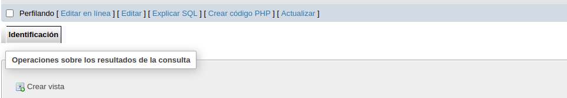

6. Si se desea obtener los registros cuyos nombes que empiecen por a letra 'A', se debe utilizar el operador LIKE que utiliza los patrones '%' y '_' (caracter).

`SELECT * FROM usuario WHERE nombre LIKE 'A%'`

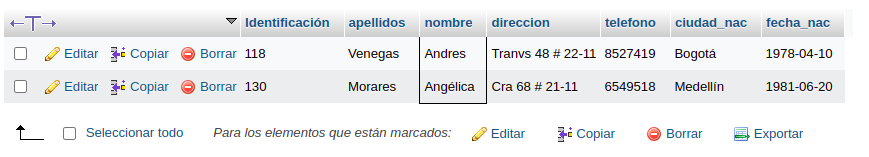

7. Si desea obtener los registros cuyo nombre contenga la letra 'a'.

`SELECT * FROM usuario WHERE nombre LIKE '%a%'`

8. Si desea obtener los registros donde la cuarta letra del nombre sea una 'a'.

`SELECT * FROM usuario WHERE nombre LIKE '___a%`

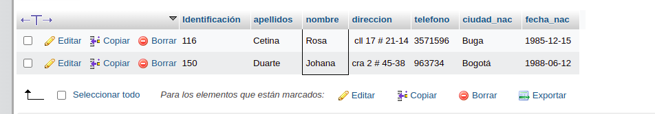

9. Si se desea obtener los registros cuya identificacion este entre el intervalo 110 y 150, se debe utilizar la clausula BETWEEN, que sirve para especificar un intervalo de valores.

`SELECT * FROM usuario WHERE Identificación BETWEEN '110' AND '150'`

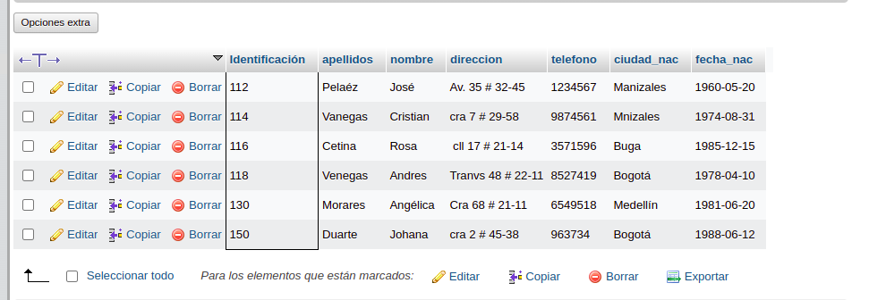

## COMANDO DELETE

10. Para utilizar solamente los registros cuya identificación sea mayor que 130

`DELETE * FROM usuario WHERE Identificación>130'`

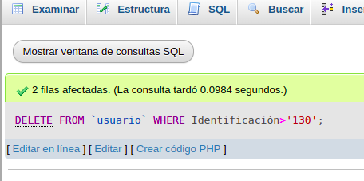
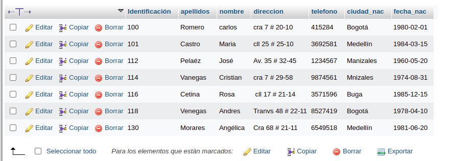

## COMANDO UPDATE
11. Para actualizar la ciudad de nacimiento de Cristian Vanegas, cuya identificación es 114

`UPDATE usuario SET ciudad nac='Manizales' WHERE Identificación='114'`

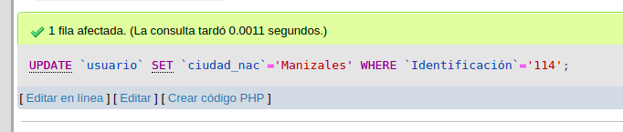
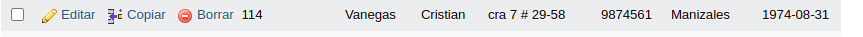